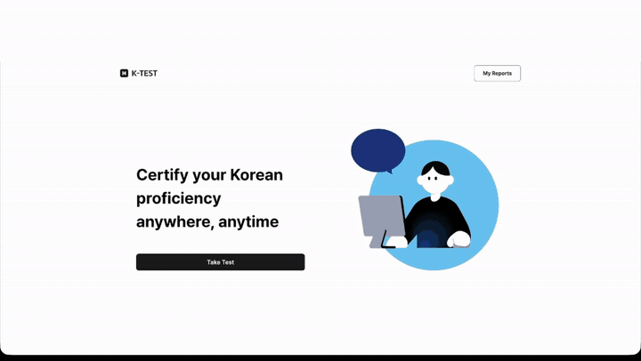
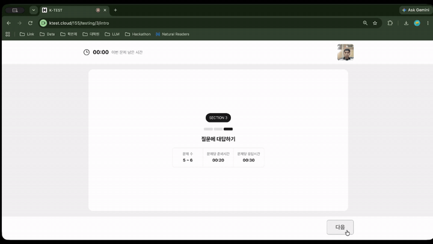
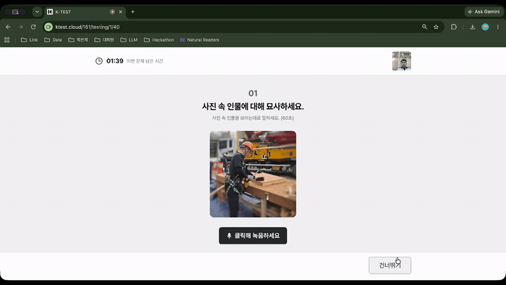
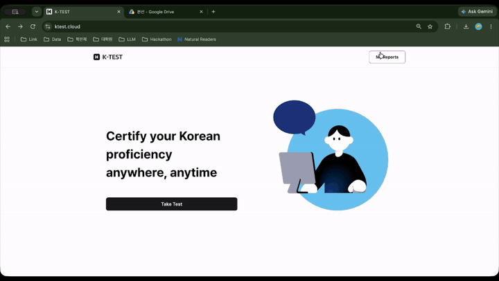
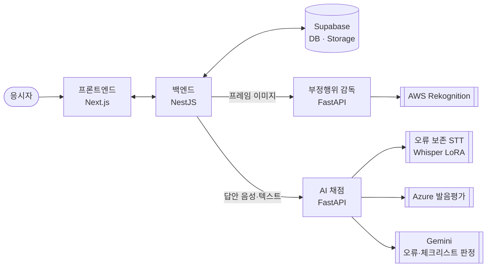

# K-TEST

**외국인 노동자를 위한 한국어 직무 소통 능력 시험**

산업 현장에서 한국어로 일할 수 있는지를 재는 온라인 시험입니다.
응시자가 말하거나 쓴 답안을 **AI가 자동으로 채점**하고, 점수와 함께 **왜 그 점수인지 근거**를 돌려줍니다.
시험 중 부정행위 감독까지 한 흐름 안에서 처리합니다.

> 제8회 K-디지털 트레이닝 해커톤 **본선 진출작**입니다.

---

## 시연

| 본인 인증 → 웹캠 캘리브레이션 | 시험 응시 (말하기 문항) |
|---|---|
|  |  |

| 부정행위 감독 — 휴대폰 실시간 탐지 | 결과 리포트 |
|---|---|
|  |  |

---

## 왜 만들었나

한국에서 일하는 외국인 노동자에게 한국어는 **안전 문제**입니다.
"위험해요, 비키세요"를 못 알아들으면 사고가 납니다.

숫자로 보면 이렇습니다.

- 외국인 취업자 중 산업현장 종사자는 **51.9만 명(2022) → 70.4만 명(2025)** 으로 늘고 있습니다.
- 외국인 근로자 관리에서 사업주가 꼽는 가장 큰 애로사항은 **의사소통(52.1%)** — 2위(문화적 차이 23.0%)의 2.3배입니다.
- E-9 근로자를 고용한 사업주의 **48.7%가 한국어 '말하기'에 불만족**합니다. 작업 지시 이해(50%), 동료와의 소통(48.9%), 안전수칙 파악(41.4%)이 필요 수준에 미달한다고 답했습니다. (「한국어 교육 개선방안 연구」, 2025)

그런데 기존 시험이 이걸 재지 못합니다. 고용허가제의 **EPS-TOPIK에는 말하기 평가가 없고**, TOPIK은 학문 목적이라 현장에서 필요한 말 — 작업 지시를 알아듣고, 사고를 신고하고, 동료의 위험을 지적하는 능력 — 을 재지 않습니다. 말하기를 면접으로 보면 대규모 응시가 안 됩니다.

그래서 **말하기 평가 + 대규모 응시**를 동시에 하려고 자동 채점을 붙였습니다. 다만 자동 채점에는 두 가지 벽이 있었습니다.

1. **AI에게 "몇 점?"이라고 물으면 매번 다른 답이 나옵니다.** 시험에는 못 씁니다.
2. **받아쓰기가 응시자의 실수를 몰래 고칩니다.** 채점할 오류 자체가 사라집니다.

이 저장소는 그 두 벽을 어떻게 넘었는지의 기록입니다.

---

## 시스템 구조



네 모듈은 **REST로만** 연결됩니다. 채점 모델을 갈아끼워도 백엔드가 수정되지 않도록 인터페이스를 먼저 고정하고 내부를 바꿉니다.

| 모듈 | 역할 | 기술 | 담당 |
|---|---|---|---|
| [`frontend/`](frontend/) | 시험 화면, 녹음, 결과 리포트 | Next.js | 한효주 |
| [`backend/`](backend/) | 인증·회차·답안 저장·AI 모듈 오케스트레이션 | NestJS · Supabase | 백예나 |
| [`anti-cheat/`](anti-cheat/) | 본인 인증, 이어폰 탐지, 시험 중 모니터링 | FastAPI · AWS Rekognition | 김도영 |
| [`assessment/`](assessment/) | 문항 설계, AI 자동 채점 파이프라인 | FastAPI · Whisper LoRA · Gemini | 전재완 |

> `frontend/`에는 현재 README만 있습니다 — 프론트엔드 구현은 이 저장소 밖에서 관리됩니다.

---

## 1. 시험 응시

응시자는 회원가입 → 본인 인증 → 시험 응시 → 결과 확인 순으로 진행합니다.

말하기 문항은 **6문항**입니다. 그림을 보고 설명하는 문항(안전 표지 읽기, 위험 상황 지적)과 질문 음성을 듣고 답하는 문항(지각 사유 설명, 사고 시 대처)으로 구성됩니다. 문항은 [`assessment/items/speaking_v1.json`](assessment/items/speaking_v1.json)에 있고 백엔드 DB에 시드로 등록됩니다.

문항마다 **체크리스트**가 붙어 있습니다. 예를 들어 "지각한 이유를 말했는가", "화살표 방향을 언급했는가" 같은 항목이 10개 안팎이고, 각 항목에 가중치가 있습니다. 채점은 이 체크리스트를 하나씩 O/X로 판정하는 것에서 시작합니다.

---

## 2. 부정행위 감독

시험 전과 시험 중 두 단계로 나뉩니다. 전부 AWS Rekognition 위에 규칙 엔진을 얹은 구조입니다.

**시험 시작 전**
- **본인 인증** — 신분증/수험표 사진과 웹캠 캡처를 `CompareFaces`로 대조, 유사도 임계값으로 판정
- **이어폰 탐지** — 좌·우 귀 이미지를 받아 `DetectLabels`로 `Earbuds`/`Headphones` 검출. 한쪽이라도 나오면 시험 시작 제한

**시험 중** (프레임 이미지를 주기적으로 수신)
- 얼굴 화면 이탈 · 다중 인원 감지
- Eye Direction + Head Pose 기반 **시선·고개 방향 분석**, 응시자별 **연속 이탈 상태** 관리
- 기준 얼굴과 현재 얼굴을 비교하는 **중간 동일인 확인**
- 휴대폰 탐지, 고개 각도 조건을 만족할 때 이어폰 추가 탐지

탐지 결과는 그 자리에서 점수가 되지 않습니다. **Rule Engine**이 항목들을 모아 위험도(`severity`)와 조치(`decision`)를 정하고, **Event Engine**이 이를 `event_summary` + `events` 형태로 변환해 백엔드에 넘깁니다. 판정 기준(임계값)은 전부 [`anti-cheat/app/core/config.py`](anti-cheat/app/core/config.py) 한 곳에 모여 있습니다.

자세한 내용: [`anti-cheat/README.md`](anti-cheat/README.md)

---

## 3. AI 자동 채점

이 프로젝트에서 가장 두꺼운 부분입니다.

### 채점 흐름

```
답안 도착
  │
  1. STT 전사 보정      말하기만. 기계가 잘못 받아쓴 곳을 고침
  │                     → 내용은 보정본, 문법은 원본으로 채점
  2. 규칙 자질 추출     Kiwi 형태소 분석. LLM 없이 항상 같은 값
  3. LLM 판정           문법 오류 찾기 + 체크리스트 O/X (동시 호출)
  4. 인용 검증          원문에 없는 근거는 폐기하고 0점 처리
  5. 점수 결합          자질 → 영역 점수 → 종합 점수
  6. 최종 등급          문항별 결과를 모아 등급·백분위
```

점수는 세 영역으로 나옵니다.

| 영역 | 무엇을 보는가 | 비중 |
|---|---|---:|
| 내용·과제 수행 | 물어본 것에 답했는가 (체크리스트 충족률 + 발화량) | 0.36 |
| 언어 사용 | 조사·어미활용·어휘·높임법 오류, 어휘 등급, 맞춤법 | 0.44 |
| 발화 전달력 | 발음 정확도 (Azure 발음평가) | 0.20 |

> **비중은 전부 임시값입니다.** 라벨링 데이터로 학습한 값이 아닙니다. 답안끼리 비교하는 데는 쓸 수 있으나 확정 등급 통보에는 쓸 수 없으며, 이 경고는 API 응답(`weights_provisional: true`)에도 함께 실려 나갑니다.

### 설계 원칙

이 네 가지가 "AI가 채점했는데 믿을 만한가"에 대한 우리의 답입니다.

1. **LLM은 사실 확인만, 점수 계산은 코드가 한다.**
   "몇 점?"은 물을 때마다 다르지만 "이 말을 했나?"는 안정적입니다. LLM에게는 O/X만 묻고, 그 O/X를 점수로 바꾸는 것은 전부 코드입니다. `temperature 0` 고정이라 같은 답안은 항상 같은 점수가 나옵니다.

2. **근거 없는 점수는 만들지 않는다.**
   모든 판정에 답안 원문 인용과 위치가 붙습니다. 그리고 **그 인용이 원문에 실제로 있는지 코드가 다시 검사합니다** — 없으면 그 판정은 폐기하고 0점 처리합니다. AI가 지어낸 근거로 점수가 오르는 일을 막는 장치입니다.

3. **LLM이 죽어도 채점은 멈추지 않는다.**
   대신 무엇이 빠졌는지를 `warnings`와 `meta.reliability`에 남깁니다. 신뢰도가 떨어진 채점은 응시자에게 보여주지 않도록 `safe_to_show_candidate: false`로 표시됩니다.

4. **임시값은 임시값이라고 크게 써 둔다.**
   가중치·등급 커트라인·백분위가 모두 학습 전 임시값이고, 그 사실이 응답에 실려 나갑니다.

### 자질 추출의 경계

자질을 추가할 때 **규칙으로 셀 수 있으면** [`features/lexical.py`](assessment/src/features/lexical.py), **판단이 필요하면** [`features/errors.py`](assessment/src/features/errors.py)입니다. 이 경계가 재현성을 만들기 때문에 섞지 않습니다 — 규칙 자질은 LLM 없이 항상 같은 값이 나오고, 그래서 LLM이 흔들려도 점수의 절반은 흔들리지 않습니다.

자세한 내용: [`assessment/README.md`](assessment/README.md)

---

## 4. 오류 보존 STT — 직접 학습시킨 받아쓰기 모델

말하기 채점의 첫 관문은 음성을 **그대로** 받아쓰는 것입니다. 그런데 여기서 문제가 터졌습니다.

### 문제 — 받아쓰기가 응시자의 실수를 몰래 고친다

상용 STT는 회의록·자막용으로 만들어져서, 발음의 편차를 잡음으로 보고 표준 표기로 수렴시킵니다. 응시자가 "**개**료를 넣어요"라고 말해도 "**재**료를 넣어요"로 적습니다. 뒤에 붙는 채점 모델이 아무리 정교해도 **평가할 오류가 이미 사라진 답안**을 채점하게 됩니다.

이게 특정 모델의 결함인지 기술 전반의 성질인지 확인하려고, 사람이 검증한 gold 100건을 **받아쓰기 모델 8종**에 똑같이 물렸습니다.

- 학습자 오류 자리 **315곳 중 93곳(29.5%)이 세탁**됐습니다. 어떤 모델을 골라도 오류 열 개 중 두세 개가 조용히 사라집니다.
- 가장 정직한 모델(OWSM-CTC v4)도 21.1%, 가장 심한 모델(Whisper medium)은 35.0%.
- **잘 듣는 모델일수록 더 세탁했습니다.** Whisper medium은 CER이 가장 낮은데(11.1%) 오류 보존율은 8종 중 꼴찌(65.0%)였습니다.

**모델을 잘 고르는 것으로는 해결되지 않습니다.** 그래서 직접 학습시켰습니다.

> **용어**
> **CER(글자 오류율)** — 받아쓴 글을 정답으로 고치는 데 글자를 몇 번 손대야 하는가. 낮을수록 잘 듣습니다.
> **오류 보존율** — 응시자가 실제로 틀리게 말한 자리를 **틀린 그대로** 적어준 비율. 낮으면 몰래 고쳐준 것입니다.
> **대조군 오탐율** — 제대로 읽은 녹음인데 다르게 적어서 **없는 오류를 만들어낸** 비율.
> **세탁** — 틀린 말을 표준어로 고쳐 적는 것. 채점의 가장 큰 적입니다.

### 밑바탕 선정 — 크기가 클수록 좋은 게 아니었다

정확도가 아니라 **오류 보존율 하나**로 골랐습니다.

| | Whisper small | Whisper medium | Whisper large-v3 |
|---|---:|---:|---:|
| 평균 CER | 56.7% | **11.1%** | 49.3% |
| **오류 보존율** | **73.7%** | 65.0% | 70.5% |
| 대조군 오탐율 | 33.3% | **22.2%** | 51.9% |
| 폭주 + 빈 전사 | 2건 | 2건 | **22건** |
| 처리 속도 | **3.7초/건** | 6.8초/건 | 24.2초/건 |

`small`을 골랐습니다. 상용·공개 모델과 견줘도 Qwen3-ASR-1.7B(67.5%)보다 높습니다.

> **정직 표시**: small과 medium의 보존율 차이는 +0.087 [0.000, +0.204]로 신뢰구간이 0에 닿습니다. **"small이 medium보다 정직하다"고 통계적으로 주장할 수는 없습니다.** 점 추정 1위 + 속도 + 학습 비용을 근거로 정했습니다.

### v1 — 그냥 파인튜닝했고, 실패했다

**방법**: Whisper small에 LoRA, 학습쌍 10,151건, 목표는 **"사람 전사에 가깝게"(CER 최소화)**.

**결과: 밑바탕과 통계적으로 구분되지 않았습니다.** 같은 파일로 짝지은 부트스트랩 2,000회를 돌렸습니다.

| 지표 (v1 − 밑바탕) | 차이 [95% 구간] | 판정 |
|---|---|---|
| 중앙 CER | −0.005 [−0.028, +0.021] | 구분 불가 |
| 평균 CER | −0.401 [−1.082, +0.084] | 구분 불가 |
| 오류 보존율 | −0.039 [−0.127, +0.027] | 구분 불가 |
| 대조군 오탐율 | −0.037 [−0.167, +0.087] | 구분 불가 |

네 지표 전부 구간이 0을 걸칩니다. 개선도 악화도 주장할 수 없습니다.

원인을 세 갈래로 갈랐습니다.

1. **학습 목표가 틀렸다.** "사람 전사에 가깝게"로 학습하면 정직함은 오르지 않습니다. **정직함은 CER과 다른 축**입니다.
2. **정답지가 세탁돼 있었다.** ← v2의 직접적인 이유
3. **데이터가 낭독에 쏠렸다.** 10,151 = 낭독 6,500 + 자유발화 3,651, 성적도 낭독 CER 9.9% vs 자유발화 27.1%로 갈렸습니다.

**이 실패를 숨기지 않는 이유**: 실패가 없으면 다음 단계가 존재할 이유가 없습니다. "그냥 파인튜닝하면 되지 않나"라는 질문에 우리는 **실측으로 답할 수 있습니다.**

### v2 — 정제의 방향을 뒤집었다 (현재 제출본)

v1의 원인 ②를 친 것입니다. 먼저 정답지가 정말 오염됐는지 셌습니다.

**팀원 5명이 499건을 나눠 맡아 음성을 직접 듣고 라벨과 한 자씩 대조**했습니다.

| 항목 | 실측값 |
|---|---|
| 검증 건수 | 499건 (낭독 294 · 자유발화 205) |
| 라벨이 실제 음성과 달라 교정한 건수 | **164건 (32.9%)** |
| 갈래별 라벨 오류율 | 낭독 19.3% · **자유발화 58.0%** |

**세 건 중 한 건꼴로 정답지가 틀려 있었습니다.** 사람 전사자도 무의식적으로 세탁을 합니다("개료"→"재료", "있슴다"→"있다", 군말 누락).

1만 건을 사람이 다 고치는 건 불가능하므로, **독립 모델 4종의 다수결로 오염 라벨을 자동 탐지**했습니다. **핵심은 방향입니다.**

> 통상의 데이터 정제는 "모델들과 어긋나는 라벨"을 버립니다.
> 그런데 오류 보존 학습에서 모델과 어긋나는 라벨은 대부분 **우리가 가장 지켜야 할 라벨**(사람이 오류를 정직하게 적어둔 자리)입니다. 통상의 정제를 그대로 쓰면 목표 신호를 먼저 지웁니다.
>
> **그래서 조건을 뒤집었습니다** — 여러 모델이 **오류 형태로 일치**하는데 라벨만 표준형인 자리를 오염으로 판정하고, 그 학습쌍만 제외합니다.

증인 구성도 설계 대상이었습니다. 성격이 같은 모델끼리 모으면 같이 틀려서 다수결이 '다수의 착각'이 되므로, **문맥형 2종(Whisper small · Qwen3-ASR-1.7B) + 직청형 2종(OWSM-CTC v4 · SenseVoice-small)** 으로 섞었습니다. 우리 LoRA는 **의도적으로 증인에서 제외**했습니다 — 그 데이터로 학습해 세탁 라벨까지 외웠을 수 있고, "우리 모델이 우리 학습 데이터를 심사"하는 순환 구조는 방어가 되지 않기 때문입니다.

**전수 정제 결과** (학습쌍 10,151건 · 증인 4종 받아쓰기 40,604줄)

| 판정 | 건수 | 비율 |
|---|---:|---:|
| suspect (세탁 의심 — 제외) | 1,116 | 11.0% |
| hold (판정 보류 — 남김) | 1,165 | 11.5% |
| keep (건강 — 남김) | 7,870 | 77.5% |

| 자리 단위 판정 | 곳 |
|---|---:|
| 세탁 (라벨이 표준형으로 수렴) | 1,270 |
| **역방향 (라벨이 오류를 제대로 살림)** | **1,640** |

**역방향이 세탁보다 많다**는 것이 이 정제기가 "라벨을 무더기로 버리는 도구"가 아니라는 근거입니다. 학습쌍은 10,151 → **9,035건**이 됐고, 이걸로 v2를 학습했습니다.

**v1과 달라진 것은 학습 데이터뿐입니다.** 모델·설정·평가 시험지는 전부 동일합니다. 따라서 차이가 나면 그 차이는 전부 정제 효과입니다.

### v3 — 학습률이 낮아 v2와 같은 모델이 됐다

설계는 3단이었습니다: **1단 대량 → 2단 고품질 마무리 → 3단 선호학습(DPO)**. 2단까지 갔습니다.

**방법**: v2 어댑터 **위에** 팀원이 직접 귀로 검증한 교정본 800건을 `lr 3e-6` · 1에폭으로 얹음 (GCP L4, 학습 56초).

**결과: 좋아지지 않았습니다.** 원인은 둘입니다.

1. **학습률이 너무 낮았습니다.** 보존율 71.7% → 71.9%, 대조군 오탐율은 완전히 동일. **사실상 v2와 같은 모델**이 나왔습니다.
2. **설계에 있던 `<verbatim>` 태그와 오류 토큰 가중을 빼고** 소량만 얹어서는 효과가 없었습니다.

게다가 CER이 16.6% → 23.4%로 **나빠졌습니다**. 판정 사례의 전사는 v2와 글자 하나 다르지 않은데 평균만 오른 것으로 보아, 소수 건의 폭주 출력이 평균을 끌어올린 것으로 의심하고 있습니다.

**→ 제출본은 v2를 유지합니다.**

### 성능 비교

<!-- TODO: base·v1·v2·v3 를 같은 시험지(team2000_test)로 재평가한 뒤 채운다. v1 어댑터를 GCP VM에 올려야 함 -->

| 모델 | 학습 데이터 | 오류 보존율 | 대조군 오탐율 | 평균 CER |
|---|---|---:|---:|---:|
| Whisper small (밑바탕) | — | 79.3% | 40.7% | 19.7% |
| LoRA v1 | 10,151건 (정제 전) | 측정 예정 | 측정 예정 | 측정 예정 |
| **LoRA v2 (제출본)** | **9,035건 (정제 후)** | **71.7%** | **29.6%** | **16.6%** |
| LoRA v3 | v2 + 교정본 800건 | 71.9% | 29.6% | 23.4% |

> 시험지: 팀 교정본 test 쪽 **778건**(오류 든 낭독 119 · 대조군 81), GCP L4에서 같은 파일·같은 계산 코드로 측정.
> **v1 행은 재측정 중입니다** — v1은 gold 100건 기준으로만 측정돼 있어 같은 시험지 값이 아직 없습니다. 시험지가 다른 수치를 한 표에 섞지 않기 위해 비워 둡니다.

### 지금 확보한 것 — 성능이 아니라 성질

- **가중치를 우리가 갖고 있습니다.** 외부 API 없이 오프라인 채점이 가능하고, 시험 중 응시자 음성이 밖으로 나가지 않습니다(개인정보·부정행위 양쪽에서 유리).
- **증언이 빠지는 일이 가장 적습니다.** 폭주·빈 전사 합계 1건. 같은 시험지에서 Qwen3-ASR은 10건, large-v3는 22건.
- **가장 빠릅니다.** 3.4초/건 — 현장 실시간 채점에 충분합니다.
- **재현성이 있습니다.** 온도 0 고정, 같은 입력에 같은 출력.

> 오류 보존율 지표는 우리가 처음 만든 것이 아닙니다. ACL 2024 *"Error-preserving ASR of Young English Learners"*(Michot et al., ZHAW)가 WEPR로 먼저 정의했고, 우리는 그 정의를 **한국어 어절 단위**로 옮겨 썼습니다.

---

## 5. 백엔드 연동

백엔드와 AI 모듈은 **REST로만** 연결됩니다. 계약은 [`assessment/src/scoring/schema.py`](assessment/src/scoring/schema.py) 한 곳에 있고, 여기를 바꾸면 백엔드가 깨집니다.

### 채점 — 엔드포인트 2개

**문항이 끝날 때마다 `/score`, 시험이 끝나면 `/finalize`.**

```http
POST /score
X-API-Key: (전달받은 키)
Content-Type: application/json
```
```jsonc
{
  "submission_id": "sub-0001",
  "mode": "speaking",
  "audio": { "url": "https://.../answer.webm" },
  "item": {
    "id": "SPK-104",
    "prompt": "사진을 보고 무엇이 위험한지 설명하세요.",
    "scene_description": "동료가 안전모 없이 사다리를 들고 있다",
    "checklist": [ /* ... */ ]
  }
}
```

응답에는 종합 점수, 영역별 서브스코어, 체크리스트 항목별 O/X와 **근거 인용**, 그리고 신뢰도 판정이 들어갑니다.

- `POST /score` — 문항 하나 채점
- `POST /finalize` — 문항별 결과를 모아 최종 등급·백분위
- `POST /generate-items` — 관리자가 안전 문서를 넣으면 맞춤 문항 자동 생성
- `POST /verify-items` — 관리자가 고친 문항 재검증
- `GET /health` — STT·LLM·ffmpeg 가용성 실시간 확인 (실제로 두드려 보고 답합니다)

인증은 `X-API-Key` 헤더입니다. 서버에 키가 설정돼 있으면 모든 POST에 필요하고, `GET /health`와 `/docs`는 어느 쪽에서도 열려 있습니다.

### 음성 입력 처리

브라우저 녹음은 `webm`, iOS 사파리는 `m4a`로 옵니다. 받아쓰기 모델은 `wav`만 열 수 있습니다. 그래서 **채점 서버 입구에서 ffmpeg로 16kHz 모노 wav로 딱 한 번 변환**하고, 그 뒤로는 LoRA·Azure 발음평가·무음 판정이 전부 같은 wav를 받습니다. 변환이 실패하면 조용히 넘기지 않고 `503`으로 알립니다(무음 답안이 0점으로 흘러가는 것을 막기 위해).

변환 품질은 실측했습니다 — webm 왕복 상관계수 0.9991 · SNR 27.5dB.

### 응답 형식

백엔드에서 프론트로 나가는 모든 응답은 성공/에러 관계없이 같은 봉투 구조를 갖습니다.

```jsonc
{ "success": true, "statusCode": 200, "message": "OK",
  "data": { /* payload */ }, "path": "/users/me", "timestamp": "..." }
```

자세한 내용: [`backend/README.md`](backend/README.md)

---

## 빠른 시작

### 전체 빌드 확인

```bash
docker compose build          # backend + anti-cheat 를 한 번에 빌드
```

> 두 서비스는 배포 주기가 다른 별개 서비스라 같이 실행할 필요는 없습니다. 로컬에서 둘 다 제대로 빌드되는지 확인할 때 씁니다.

### 백엔드

```bash
cd backend
npm install
cp .env.example .env          # Supabase URL/키, JWT 시크릿을 채운다
npm run start:dev             # http://localhost:3000/docs 에서 Swagger 확인
```

### 부정행위 감독

```bash
cd anti-cheat
python3.11 -m venv face_api && source face_api/bin/activate
pip install -r requirements.txt
cp .env.example .env          # AWS 자격증명과 임계값을 채운다
uvicorn app.main:app --port 8080
```

### AI 채점

```bash
cd assessment
python -m venv .venv && source .venv/bin/activate   # Windows: .venv\Scripts\activate
pip install -r requirements.txt
cp .env.example .env          # GEMINI_API_KEY 등을 채운다
uvicorn src.api:app --port 8001

# 답안 하나를 실제로 채점해 보기
python scripts/check_pipeline_demo.py
```

말하기 채점은 `.env`의 `KTEST_STT_PROVIDER` 설정을 따릅니다. `lora`로 두면 **LoRA 받아쓰기 서버(8100)가 떠 있어야** 하고, 안 떠 있으면 `503`이 납니다. GPU 없이 확인만 하려면 `gemini`로 두면 됩니다.

### 테스트

```bash
cd assessment
pip install -r requirements-dev.txt   # scipy·scikit-learn·g2pkk (실험용, 서버에는 불필요)
pytest                                 # 1,390개
```

---

## 개발 규칙

각자 자신의 디렉토리 안에서 작업합니다. 자기 디렉토리 밖에 새 디렉토리가 필요하면 자유롭게 만들되, **무엇을 위한 곳인지 README.md를 작성**하고 처음 보는 사람도 이해할 수 있게 이름을 짓습니다.

**브랜치**
- `main`에 **직접 push 금지**
- 모든 작업은 **기능 브랜치**에서, **PR로만 머지**
- 머지 전 최신 `main`을 받아 반영하고 **직접 실행해 정상 동작 확인**
- 확인이 끝나 문제없으면 스스로 머지, **머지 후 브랜치 삭제**
- **다른 팀원의 디렉토리를 수정해야 하면 머지 전에 반드시 합의**

**디자인 에셋** — 문항 삽화 등 이미지는 용량이 커서 저장소에 커밋하지 않고 [구글 드라이브](https://drive.google.com/drive/folders/1n5dDWZwiPKvF7PMtWnnJXBoOp4ggpUnJ?usp=sharing)로 공유합니다 (담당: 양은희).

**보안** — AWS 키, Supabase 키, Gemini/Azure API 키, `.env`, 실제 신분증·웹캠 이미지는 **어떤 경우에도 커밋하지 않습니다.** 실수로 올라갔다면 즉시 팀에 공유해 주세요.

---

## 현재 한계

숨기지 않고 적습니다.

- **점수 결합 가중치가 학습 전 임시값입니다.** 답안 사이 비교에는 쓸 수 있으나 확정 등급 통보에는 쓸 수 없습니다. 이 경고는 API 응답에도 실려 나갑니다.
- **LoRA v3는 실패했고 제출본은 v2입니다.** 위 4절 참고.
- **`frontend/`에 구현이 없습니다.** 프론트엔드는 이 저장소 밖에서 관리됩니다.
- **백엔드의 `question`/`submission`/`scoring` 모듈 Repository가 예전 테이블명을 참조합니다.** 새 ERD에 맞춰 재작성이 필요합니다([`backend/README.md`](backend/README.md)의 "알려진 이슈" 참고).
- **RLS는 켜져 있지만 정책이 없습니다.** 인가 판단은 전적으로 애플리케이션 계층(Guard) 책임입니다.

---

## 팀

| 이름 | 파트 |
|---|---|
| 한효주 | 프론트엔드 |
| 백예나 | 백엔드 |
| 김도영 | 부정행위 감독 |
| 전재완 | 문항 설계 · AI 자동 채점 |
| 양은희 | 디자인 |
